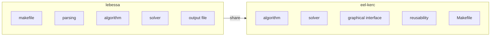
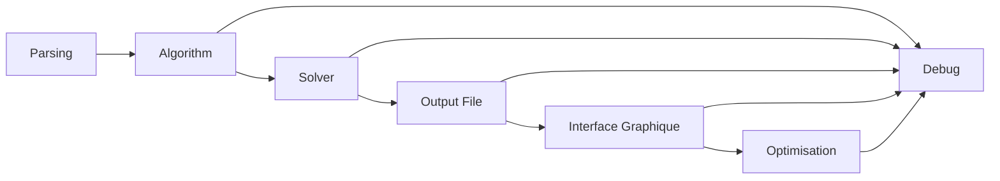

*This project has been created as part of the 42 curriculum by lebeyssa, eel-kerc.*


## Descripton

**A-maze-ing** is a maze generation project.  
Any algorithm can be used to generate and solve the maze.  
Maze configuration is parsed in a .txt file.  
Maze informations is then stored in a output_maze.txt.  
The maze algorithm can be transform in a .whl to be reuse in other projects that requires maze. 


## Instructions

 To run this project, you should **install the required dependencies** with the following command 
 ``` shell
 make install
 ```  
It is recommanded to use a virtual environment for dependencies installation.   

Then, you can run with the command 
``` bash
make run
```

 To create the .whl and .tar, run the command 
 ``` bash
 make build
 ```


For norm and typing checking, run:
 ``` bash 
 make lint 
 ```
or 
``` bash
make lint-strict
``` 
for strict checking.

Run 
``` bash
bash make clean
```  
to clean dependencies like pycache or created files.

To run the project in debug mode using
python built-in debugger, run 
``` bash
make debug
```


## Projects choices

### Config format:
The configuration file is set up in key=value format to retrieve the data necessary for generating and solving the maze

Example: 

    # mandatory keys
    WIDTH=10
    HEIGHT=10
    ENTRY=0,9
    EXIT=0,7
    OUTPUT_FILE=output.txt
    PERFECT=false

    # additional keys
    SEED=2
    WINDOW=1

The key SEED=45 (always the same maze) and WINDOW= 1 <= x <= 3 (display window) are optional

### Mazes generations and algorithms:
We have implemented 3 algorithms
- ***Breadth-First Search (BFS) Maze Generation:***

   The Breadth-First Search (BFS) algorithm can be used to
   generate a maze by exploring the grid level by level, starting from an initial
   cell and progressively visiting its neighbors.

   The process works as follows:

   Initialization
   Start with a grid where all cells are considered walls.
   Choose a starting cell (entry point), mark it as a passage, and add it to a queue.
   Exploration using a Queue
   While the queue is not empty:
   Remove the first cell from the queue (FIFO order).
   Look at its neighboring cells (usually up, down, left, right).
   Carving Paths
   For each neighbor:
   If the neighbor has not been visited yet:
   Remove the wall between the current cell and the neighbor.
   Mark the neighbor as visited (turn it into a passage).
   Add the neighbor to the queue.
   Continue Until Completion
   Repeat the process until all reachable cells have been visited

- ***Kruskal’s Algorithm for Maze Generation:***

   Kruskal’s algorithm is a randomized approach based on the concept of a minimum spanning tree.
   It generates a maze by connecting cells while ensuring there are no cycles,
   resulting in a perfect maze (one unique path between any two cells).

   The process works as follows:

   Initialization
   Start with a grid where every cell is surrounded by walls.
   Treat each cell as an individual set (disjoint set / union-find structure).
   List all walls between adjacent cells.
   Randomized Wall Selection
   Shuffle the list of walls randomly.
   Processing Walls
   For each wall in the shuffled list:
   Identify the two cells separated by the wall.
   If these cells belong to different sets:
   Remove the wall (create a passage).
   Merge the two sets (union operation).
   Otherwise, keep the wall (to avoid cycles).
   Completion
   Continue until all cells are connected into a single set.

 - ***Wilson’s Algorithm for Maze Generation:***

   Wilson algorithm is a full random based algorithm. It is known as one of the most random maze generator. It is not optimised for big mazes size because of it's logic implementation. It use a loop erased algorithm to not fall into an infinite loop.

   The process works as follows:

   Initialization
   Start by chosing 2 random cells in the maze, defining the start and the end.   
   It loop from the start in random neighbors until it reaches the end.   
   When it loops until his own cell, it erases part of the loop and try another one.   
   If it hit a wall or invalid cell, it cames back.   
   When it reaches the end, it open all of the walls in the paths.   
   Then, and until the maze is finished it makes these operations:   
   It chooses a cell that has not been open yet.   
   It loops until it reaches the the current maze with the same loop and fall back logic.

### Why the algorithms

These three algorithms allowed us to see different ways of generating a maze, as well as their drawbacks and advantages.   
Breadth-First Search (BFS), Kruskal’s algorithm, and Wilson’s algorithm each have distinct strengths and weaknesses for maze generation.   
BFS is simple and fast to implement, producing mazes with good connectivity and short paths, but it tends to create uniform, less interesting structures with low randomness and limited challenge.    
Kruskal’s algorithm generates perfect mazes with a good balance of randomness and structure, avoiding cycles and scaling efficiently with the help of a Union-Find data structure, though it is more complex to implement, uses more memory, and offers limited control over the maze’s visual style.   
Wilson’s algorithm, on the other hand, produces perfect mazes with true uniform randomness and natural, organic-looking paths thanks to loop-erased random walks, but it is slower, more complex to implement, and has less predictable performance, especially on large grids.

### Project reusability

The maze generators can be transformed into a .whl (a binary file) and a .tar (a zip file) that can be reused in other project.   
The .whl can be install with the command pip install or the .tar unzip with the command tar -xf.   
To create these file, you can run the command make build.    
The project is in a directory name mazegen and can be imported after installation as import mazegen.   

### Project management:

***role of each member***



***project progress order***



### What is working well and what can be improved

The project is working well overall.   
What can be imrpoved is the mlx usage with the commands, because the mlx nerfed the string put and it crashes sometimes.   
A function that create text with image can be done to be perfect.   


### Tools used descriptions

For parsing we used the pydantic module and for the graphical interface we used the MLX library

-MLX

MLX is a machine learning framework developed by Apple, designed specifically for Apple Silicon (M-series chips).   
It provides efficient tensor operations, automatic differentiation, and support for building and training models   
with high performance on Mac devices. MLX emphasizes simplicity, flexibility, and tight integration with the Apple ecosystem,  
making it suitable for research, prototyping, and on-device machine learning.  


-Pydantic

Pydantic is a Python library used for data validation and settings management based on type annotations.   
It allows developers to define data models using Python classes, automatically validating and parsing input data   
into the correct types. Pydantic is widely used in modern Python applications (especially with FastAPI) to ensure data integrity,   
reduce boilerplate code, and provide clear error messages.   


## Additionnal features management

### - Multiple algorithms management

The default algorithm is set to DFS. It can be change with keyboard interaction. The change work with indexes of the list of the algorithms, making it easy to add more algorithms.

### - Play mode

The play mode can be enable or disable with the keyboard (see commands when running).  
It works with mouse postion. It gets the position and find out which direction is the most dominant to move the square.  
Each direction has a wall check. Every check works the same way :
 - The program get the 2 corners leading to the direction (ex: north east and north west if going to the north)
 - It gets the position of the corners in the maze and the walls that requires checks
 - It finally checks if the corners coordinates are in the walls coordinates, to enable slice over differents cells.

### - Solution display

The default solution display is set to the quickest path.  
If the maze is set to not perfect, all possibles solutions can be displayed.  
There is a instant mode that can be enable/disable. If disable, the speed can be modified (see commands when running)


## Resources

Mermaid : https://mermaid.ai/open-source/intro/getting-started.html   
pydantic : https://pydantic.dev/docs/validation/latest/get-started   
algorithm : https://en.wikipedia.org/wiki/Maze_generation_algorithm ,    
https://medium.com/@batu.senturk/the-ultimate-unbiased-maze-generation-technique-you-need-to-see-46123d5fec76   
mlx : https://qst0.github.io/ft_libgfx/man_mlx.html ,    
      https://aurelienbrabant.fr/blog/getting-started-with-the-minilibx    
color management: https://htmlcolorcodes.com/    

### AI Usage

 - mlx installation comprehension
 - infinite loop debug
 - wilson algorithm comprehension and debug
